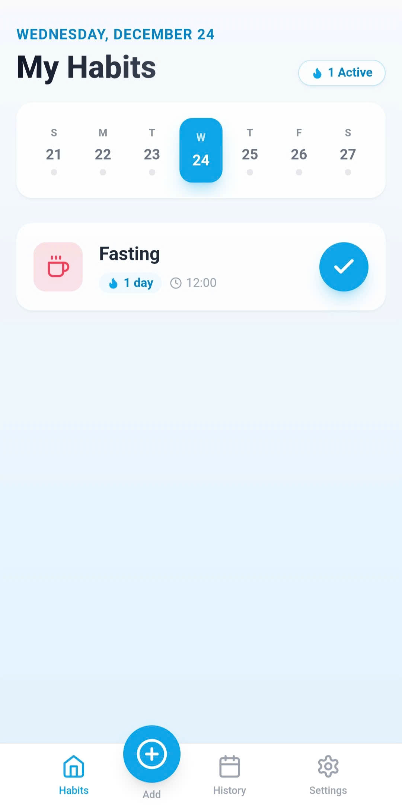
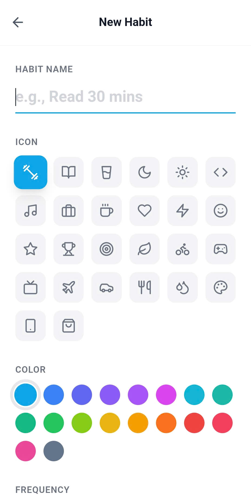
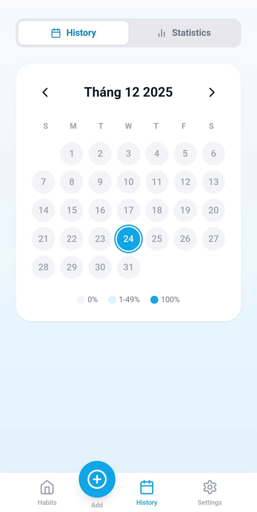
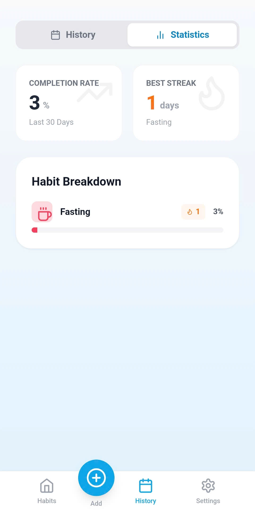
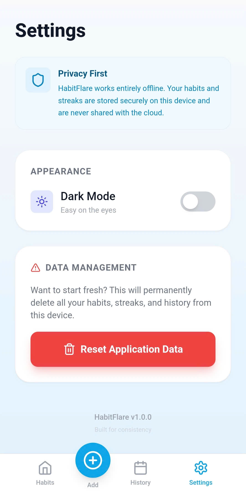
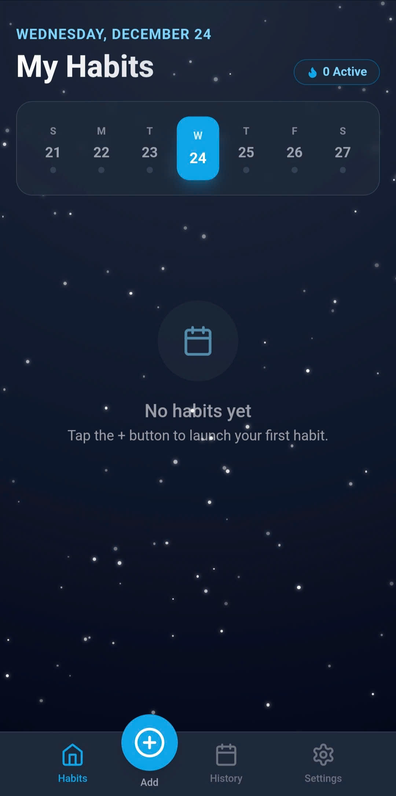

# 🔥 HabitFlare

<div align="center">
  
  ### A minimalist, streak-based habit tracker
  
  **Simple. Beautiful. Effective.**
  
  [](https://reactjs.org/)
  [](https://www.typescriptlang.org/)
  [](https://tailwindcss.com/)
  [](https://capacitorjs.com/)
  [](LICENSE)
</div>

---

## Features

### Core Features
- **Habit Tracking** - Track daily habits with beautiful visual cards
- **Streak Counter** - Stay motivated with fire emoji streak indicators
- **Weekly Calendar** - Quick navigation with visual completion status
- **Statistics Dashboard** - Analyze your habits with completion rates and charts
- **Customizable** - Choose from 28+ icons and 18 vibrant colors
- **Reminders** - Set custom alarm times for each habit
- **Flexible Scheduling** - Select specific days for each habit

### Design & Experience
- **Dark Mode** - Eye-friendly theme for day and night
- **Mobile-First** - Optimized for Android devices
- **Offline-First** - Works completely offline, no internet needed
- **Privacy-Focused** - All data stored locally on your device
- **Lightning Fast** - Smooth animations and instant responses
- **Modern UI** - Clean, minimalist design with glassmorphism effects

---

## Screenshots

### Main View


Track your daily habits with a beautiful card interface. See your active streaks at a glance.

### Add Habit View


Create new habits with custom icons, colors, and schedules. Set reminders to stay on track.

### Calendar History


Visualize your habit completion with a color-coded heatmap calendar.

### Statistics Dashboard


Track your progress with detailed completion rates and habit breakdowns.

### Settings


Customize your experience with dark mode and manage your data.

### Dark Theme


Beautiful dark theme for comfortable evening tracking.

---

## Getting Started

### Prerequisites

Before you begin, ensure you have the following installed:
- **Node.js** (v16 or higher)
- **npm** or **yarn**
- **Android Studio** (for Android builds)
- **JDK 17** (for Android builds)

### Installation

## For Android Mobile Phone
1. Download the apk file form Release
2. Install to your phone

## For PC
1. **Clone the repository**
```bash
git clone https://github.com/yourusername/habitflare.git
cd habitflare
```

2. **Install dependencies**
```bash
npm install
```

3. **Run development server**
```bash
npm run dev
```

The app will open at `http://localhost:5173`

---

## Building for Android

### Setup Android Environment

1. **Install Android Studio** from [developer.android.com](https://developer.android.com/studio)

2. **Set up environment variables:**
```bash
# Add to your system environment variables
ANDROID_HOME=C:\Users\YourName\AppData\Local\Android\Sdk
JAVA_HOME=C:\Program Files\Java\jdk-17

# Add to Path
%ANDROID_HOME%\platform-tools
%ANDROID_HOME%\tools
%JAVA_HOME%\bin
```

### Build APK

#### Debug APK (for testing)
```bash
# 1. Build web assets
npm run build

# 2. Sync to Android
npx cap sync android

# 3. Open in Android Studio
npx cap open android

# 4. In Android Studio: Build > Build Bundle(s) / APK(s) > Build APK(s)
```

APK location: `android/app/build/outputs/apk/debug/app-debug.apk`

#### Release APK (for distribution)

1. **Generate keystore** (first time only):
```bash
keytool -genkey -v -keystore habitflare.keystore -alias habitflare -keyalg RSA -keysize 2048 -validity 10000
```

2. **Move keystore** to `android/app/`

3. **Create** `android/keystore.properties`:
```properties
storePassword=YourPassword
keyPassword=YourPassword
keyAlias=habitflare
storeFile=habitflare.keystore
```

4. **Build release APK:**
```bash
cd android
./gradlew assembleRelease
```

APK location: `android/app/build/outputs/apk/release/app-release.apk`

---

## Tech Stack

| Technology | Purpose |
|------------|---------|
| **React 18** | UI framework |
| **TypeScript** | Type safety |
| **Tailwind CSS** | Styling |
| **Capacitor** | Native Android wrapper |
| **Lucide React** | Icon library |
| **Vite** | Build tool |
| **LocalStorage** | Data persistence |

---

## Project Structure

```
habitflare/
├── android/              # Capacitor Android project
├── assets/              # Images and icons
├── components/          # React components
│   ├── BottomNav.tsx   # Bottom navigation
│   └── HabitCard.tsx   # Habit display card
├── views/              # Main screens
│   ├── Home.tsx        # Home screen with habit list
│   ├── AddHabit.tsx    # Create new habit
│   ├── CalendarView.tsx # Calendar & statistics
│   └── Settings.tsx    # App settings
├── utils/              # Utility functions
│   └── dateUtils.ts    # Date manipulation helpers
├── App.tsx             # Main app component
├── constants.tsx       # Icons and colors config
├── types.ts            # TypeScript interfaces
└── index.tsx           # Entry point
```

---

## License

This project is licensed under the MIT License - see the [LICENSE](LICENSE) file for details.
